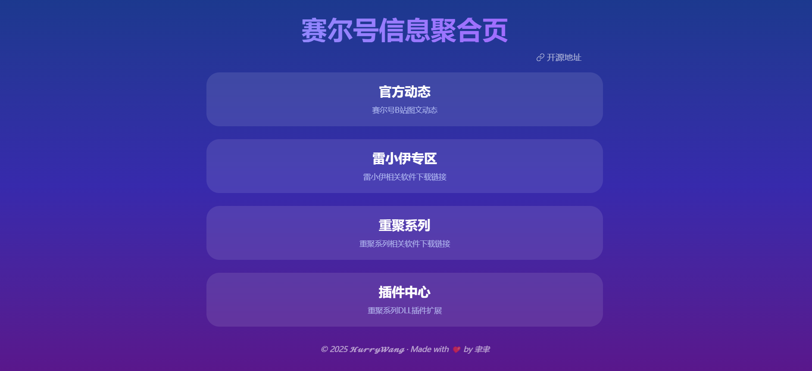
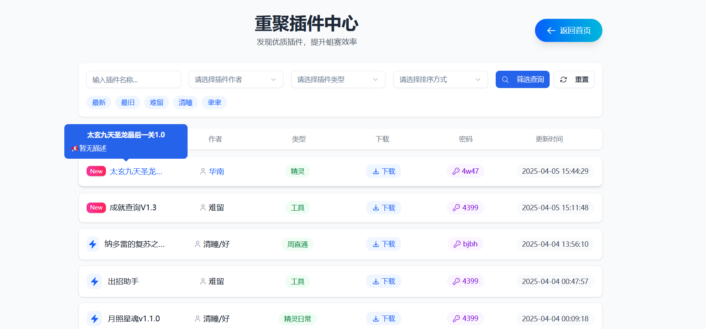
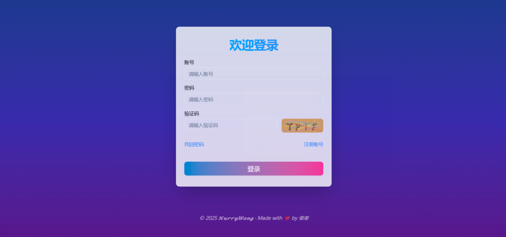
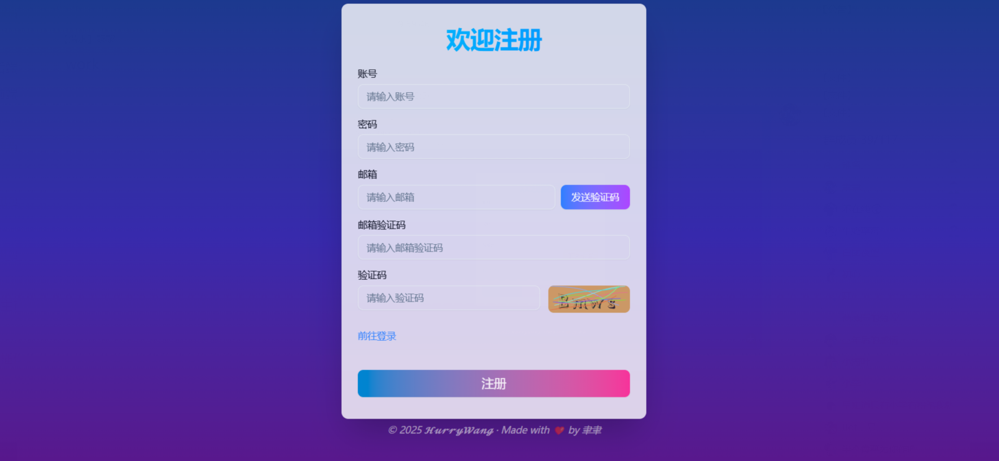
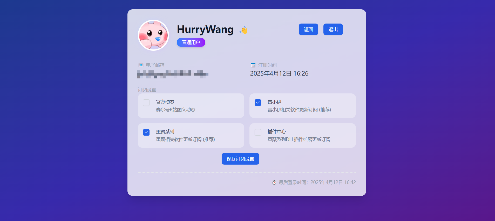

# seer-info-summary

#### 介绍

赛尔信息汇总, 将登录器下载链接, 一些赛尔咨询整合汇总显示在网页中

25.4.12 更新：支持邮件订阅

> [!WARNING]
> 本仓库为该项目的早期版本, 新版本因为涉及到部分软件逆向, 已转移至私有仓库

#### 软件架构

后端：node express 框架 mongoose

前端：vite6 vue3 tailwindcss4 shadcn-vue

#### 预览地址

https://seer.yuyuqaq.cn

https://seer.hurry.wang

