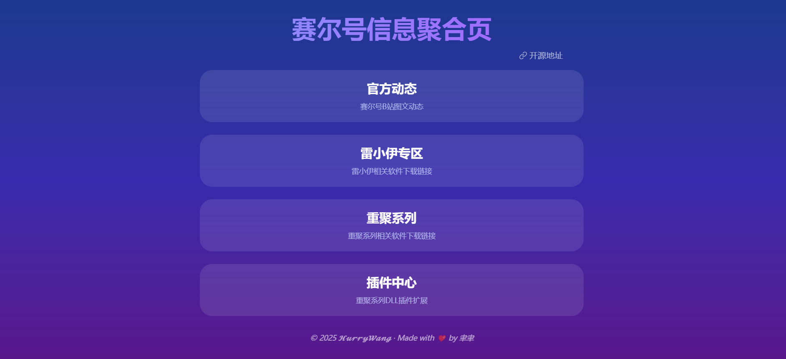
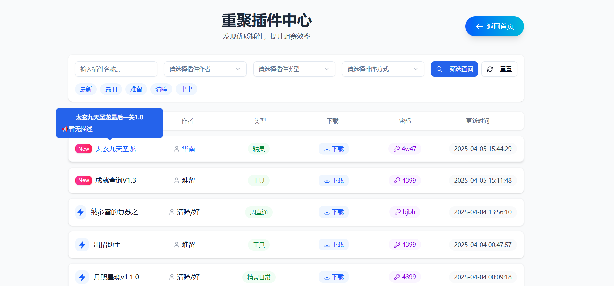
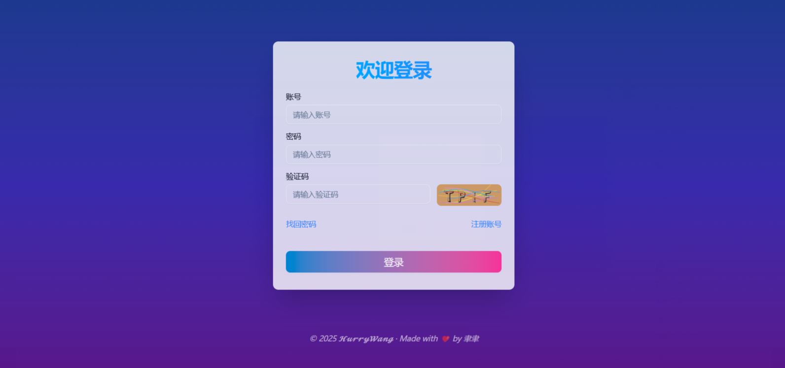
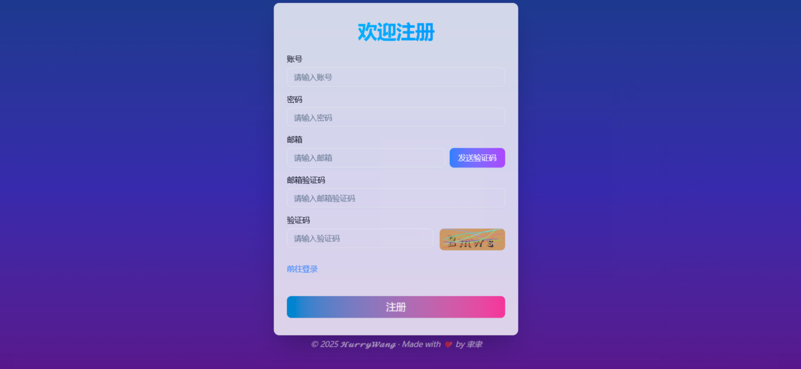
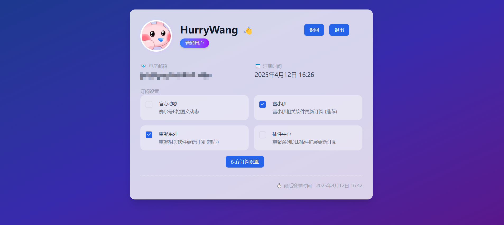

# seer-info-summary

## 介绍

赛尔信息汇总, 将登录器下载链接, 一些赛尔咨询整合汇总显示在网页中

**25.4.12 更新：支持邮件订阅**

> [!WARNING]
> 本仓库为该项目的早期版本, 新版本因为涉及到部分软件逆向, 已转移至私有仓库

## 软件架构

**后端技术栈：**
- Node.js + Express 框架
- Mongoose (MongoDB)

**前端技术栈：**
- Vite 6
- Vue 3
- Tailwind CSS 4
- shadcn-vue

## 预览地址

- 🌐 [https://seer.yuyuqaq.cn](https://seer.yuyuqaq.cn)
- 🌐 [https://seer.hurry.wang](https://seer.hurry.wang)

## 项目截图

### 主页界面

### 插件中心

### 用户登录

### 用户注册

### 用户中心

